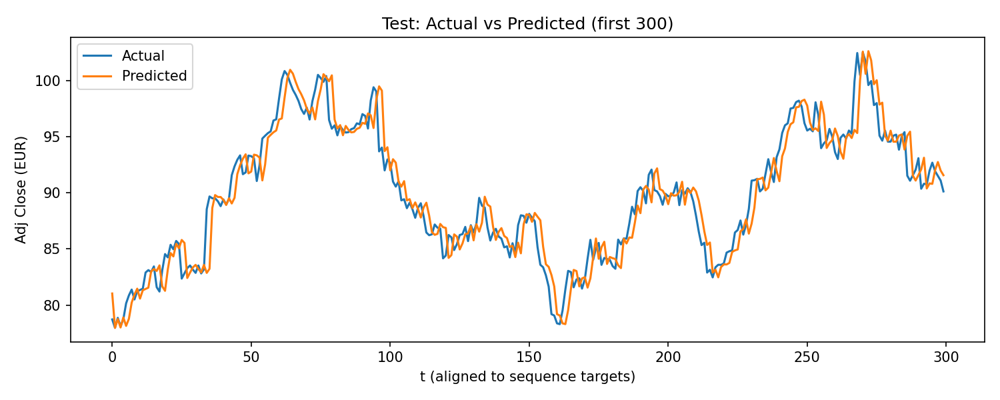

# GRU Baseline for Next-Day BMW.DE Price Forecast (Delta Target)
## TL;DR

GRU-based time-series model predicting next-day BMW stock price using delta forecasting.  
Implements leak-free evaluation and compares against a naive persistence baseline.  

**Test RMSE:** 1.93 EUR | **R²:** 0.9567  

> ⚠️ For research purposes only, not financial advice.



<p align="left">
  <a href="https://github.com/Rupesh1Khanal/bmw-gru-forecast/blob/main/LICENSE">
    
  </a>
  <a href="https://github.com/Rupesh1Khanal/bmw-gru-forecast/stargazers">
    
  </a>
  <a href="https://github.com/Rupesh1Khanal/bmw-gru-forecast/issues">
    
  </a>
  
  
  
</p>

This repository contains a clean, reproducible pipeline to forecast **next-day adjusted close** for **BMW.DE** using a single-layer **GRU** trained on **price deltas** (next-day change).  
The goal is to establish a strong, transparent **baseline** and compare it against a **naive persistence** model (price[t] = price[t−1]) with leak-free evaluation.

---

## 📂 Repository Structure

bmw-gru-forecast/  
├── artifacts/        # Generated artifacts: metrics, plots, env/config, model weights  
├── data/             # Cached Yahoo Finance CSV (downloaded on first run)  
├── notebooks/        # (optional) Jupyter notebook version of the pipeline  
├── bmw_stock_prediction.ipynb  # Script version of the pipeline (end-to-end)  
├── .gitignore        # Ignore large/binary artifacts + cached data  
├── README.md  
└── requirements.txt  # Reproducible environment specification

### Key Directories

- **`artifacts/`**  
  Stores all derived outputs:
  - `metrics.json` — final VAL/TEST metrics and % improvement vs naive  
  - `config.json`, `env.json`, `feature_list.txt` — reproducibility metadata  
  - `best_gru_bmw_model.keras` — best checkpoint by validation loss  
  - `loss_curve_log.png`, `loss_curve_smooth.png` — training curves  
  - `val_actual_vs_pred.png`, `test_actual_vs_pred.png` — overlay plots

- **`data/`**  
  Contains `bmw_raw.csv` (cached **Yahoo Finance** OHLCV for BMW.DE). Created automatically on first run.

- **`notebooks/`** *(optional)*  
  - `bmw_gru_pipeline.ipynb` — notebook equivalent of the script for interactive runs.

---

## ⚙️ Installation

1) **Create and activate a virtual environment** (`venv` example):

```bash
python -m venv .venv
# Linux/Mac
source .venv/bin/activate
# Windows
.venv\Scripts\activate
```

2) **Install dependencies from requirements.txt**:
```bash
pip install -r requirements.txt
```
## 📦 Project Environment

Python 3.10+

TensorFlow 2.10+ (CPU or GPU)

NumPy / Pandas / scikit-learn / Matplotlib

yfinance for data download & caching

## ▶️ Usage

Script (recommended):
``` bash
python bmw_stock_prediction.ipynb
```

Notebook:
Open notebooks/bmw_stock_prediction.ipynb and run all cells.

**What happens** :

- Downloads BMW.DE (or reads cached data/bmw_raw.csv)

- Engineers features & builds delta target

- Splits 70/15/15 by time, scales (fit on train only), sequences windows

- Trains GRU(96) with dropout=0.1 using EarlyStopping + LR scheduler

- Evaluates vs naive persistence with leak-free alignment

- Saves metrics & plots to ./artifacts/

## 🧠 Method

**Objective.** Forecast the **next-day adjusted close** for BMW.DE by learning the **delta** (change) from today to tomorrow and reconstructing the price.

### Target (Delta) and Reconstruction

Delta(t+1) = AdjClose(t+1) - AdjClose(t)
AdjClose_hat(t+1) = AdjClose(t) + Delta_hat(t+1)

> **Why delta?** It is small and near-zero on average, which improves optimization stability and usually generalizes better on trending price series.

### Features
From daily OHLCV (Open, High, Low, Close, Adj Close, Volume), we engineer:
- **Return**: `pct_change(AdjClose)`
- **MA10 / MA30**: rolling means of AdjClose (10, 30 days)
- **AdjClose − MA10**
- **Volatility_10**: rolling std of Return (10 days)
- **Momentum_10**: `AdjClose[t] − AdjClose[t−10]`
- **AdjClose_lag1**: yesterday’s price

Rows with NaN/±∞ from rolling/shift ops are dropped; index reset.

### Split & Scaling
- **Split**: 70% / 15% / 15% (train/val/test) in time order (no shuffling).
- **Scaling**:
  - **Features**: `MinMaxScaler` (fit on **train**, applied to val/test).
  - **Target (delta)**: `StandardScaler` (fit on **train** deltas).
- **Sequencing**: sliding windows of length **30** (configurable) built **separately** for train/val/test to avoid leakage.

### Model
- **Architecture**: GRU(**96**) → Dropout(**0.1**) → Dense(1)
- **Loss**: MSE on **scaled delta**
- **Optimizer**: Adam (`lr=5e-4`, `clipnorm=1.0`)
- **Callbacks**:
  - EarlyStopping (`patience=10`, restore best)
  - ReduceLROnPlateau (`patience=5`, factor=0.5)
  - ModelCheckpoint (save best by val loss)

### Evaluation (Validation & Test, delta → price)
For **both** VAL and TEST:
1. Predict **delta** on sequenced inputs.
2. **Inverse-transform** delta with the delta `StandardScaler`.
3. **Reconstruct price**: `price_pred[t] = AdjClose_lag1[t] + delta_pred[t]`.
4. **Align indices** to sequence targets (`seq_len … end-1`).
5. **Baseline**: persistence `baseline[t] = AdjClose_lag1[t]` (same aligned indices).
6. **Report** price metrics: **RMSE** (EUR), **R²**, and **% improvement vs baseline**.

---

## 📊 Results & Evaluation

| Split | RMSE (Model) | RMSE (Naive) | Δ vs Naive | R² |
|------:|--------------:|-------------:|-----------:|---:|
| Val   | 1.6077 | 1.6109 | 0.20% | 0.9256 |
| Test  | 1.9322 | 1.9328 | 0.03% | 0.9567 |


These results are derived from the **final trained GRU (96 units, dropout=0.1)**.  
See `artifacts/metrics.json` for exact metrics and plots.

### 📌 Interpretation

The model slightly outperforms the naive persistence baseline, but the improvement is marginal (0.03% on the test set).

This suggests that:

- Daily stock price movements are highly noisy and difficult to predict
- A simple persistence model already provides a strong baseline
- The GRU model captures some signal, but gains over the baseline remain limited

This highlights the importance of strong baselines and realistic expectations in financial time-series forecasting.

## ⚠️ Limitations

- The model shows only marginal improvement over a naive baseline
- Financial time series are highly noisy and influenced by external factors not included in the model
- Only historical price-based features are used (no macroeconomic or news data)
- Model performance may not generalize across different market regimes

### Reproducibility
- Fixed seeds for Python/NumPy/TensorFlow (42)  
- `TF_DETERMINISTIC_OPS=1` and Adam `clipnorm=1.0`  
- All scalers fit on **train only**; no refitting on validation/test

## Extensions & Next Steps
- Walk-forward (rolling-origin) evaluation to stress-test generalization out of sample.
- Feature work: RSI(14), ATR(14), MACD(12,26,9), weekday indicator, rolling min/max bands.
- Loss variants: Huber loss; probabilistic head (mean + variance) with Gaussian NLL for uncertainty.
- Architectures: BiGRU, Temporal Convolution (TCN), small Transformer encoder.
- Hyperparameter sweeps: sequence length (20–90), learning rate (1e-3 … 1e-5), dropout (0.05–0.3).
- Data hygiene: optional outlier clipping on daily returns; holiday/calendar features.
- CI: GitHub Actions smoke test on a short date range to catch breaking changes.
- Logging: append per-run rows (config + metrics) to `artifacts/experiments.csv`.


## Citations
@misc{bmw_gru_baseline_2025,
  author       = {Rupesh Khanal},
  title        = {GRU Baseline for Next-Day BMW.DE Price Forecast (Delta Target)},
  year         = {2025},
  howpublished = {GitHub repository: https://github.com/Rupesh1Khanal/bmw-gru-forecast},
  note         = {Research/education code; not financial advice}
}

## Acknowledgements
- Yahoo Finance data accessed via the `yfinance` Python library.
- Open-source tools: TensorFlow, NumPy, Pandas, scikit-learn, Matplotlib.
- Thanks to the open-source community for enabling reproducible research.
